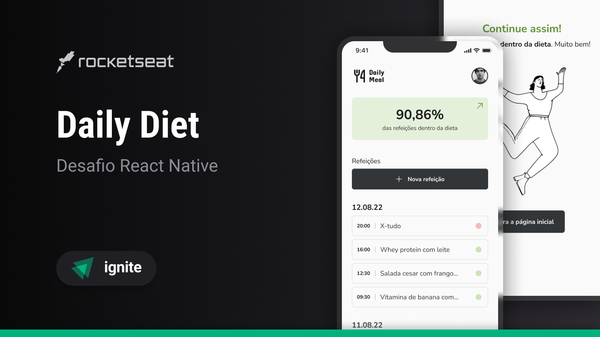

---

<p align='center'>
  
</p>

# Daily Diet - Controle Inteligente de Refeições 🥗  

Daily Diet é uma aplicação mobile desenvolvida para facilitar o monitoramento e controle de sua alimentação diária. O aplicativo permite registrar refeições, acompanhar seu progresso nutricional e manter-se no caminho certo para atingir seus objetivos de alimentação saudável. Tudo de maneira prática e eficiente, utilizando as melhores práticas e tecnologias modernas para o desenvolvimento mobile.  

---

<p align="center">
  
</p>

## 🎯 **Funcionalidades Principais**

- **Registro de Refeições:** Adicione, edite e remova refeições de forma fácil e organizada.
- **Estatísticas de Progresso:** Acompanhe visualmente seu progresso com gráficos e métricas de desempenho.
- **Organização por Horários:** Classificação automática das refeições por horários para um melhor planejamento.
- **Feedback Visual e Mensagens:** Exibição de mensagens motivacionais baseadas em seu desempenho.
- **Navegação Intuitiva:** Sistema de navegação em pilha, proporcionando uma experiência fluida ao usuário.
- **Armazenamento Local:** As refeições são armazenadas localmente para acesso offline utilizando Async Storage.

---

## 🌈 **Layout do Projeto**

Confira o layout completo e detalhado do projeto no Figma clicando [aqui](<https://www.figma.com/design/5uYbWuiRrY0uLQwawTW3Eq/Daily-Diet-%E2%80%A2-Desafio-React-Native-(Community)?node-id=2773-9356&t=Rt963C6d6oPL8LcM-0>).

---

## 🔧 **Tecnologias Utilizadas**

Este projeto foi desenvolvido com as seguintes tecnologias e bibliotecas:

- **[React Native](https://reactnative.dev/):** Framework para desenvolvimento de aplicativos móveis multiplataforma.
- **[Expo](https://expo.dev/):** Plataforma para criação e execução de aplicativos React Native de forma ágil.
- **[TypeScript](https://www.typescriptlang.org/):** Superconjunto do JavaScript que adiciona tipagem estática ao código.
- **[Styled Components](https://styled-components.com/):** Estilização baseada em componentes para maior flexibilidade e organização.
- **[React Native SVG](https://github.com/software-mansion/react-native-svg):** Manipulação de SVGs diretamente no React Native.
- **[Phosphor Icons](https://github.com/duongdev/phosphor-react-native):** Biblioteca de ícones flexível e personalizável.
- **[Date-fns](https://date-fns.org/):** Biblioteca para manipulação e formatação de datas.
- **[React Navigation](https://reactnavigation.org/):** Sistema de navegação completo e altamente configurável para apps React Native.
- **[React Native Screens](https://github.com/software-mansion/react-native-screens):** Melhor desempenho de telas com otimizações nativas.
- **[Async Storage](https://docs.expo.dev/versions/latest/sdk/async-storage):** Armazenamento local para dados de refeições e progresso.

---

## 🚀 **Como Instalar e Executar o Projeto Localmente**

### **Pré-requisitos**

- Node.js instalado em sua máquina.
- Gerenciador de pacotes (npm ou yarn).
- Um dispositivo físico ou simulador para rodar o aplicativo.

### **Passos para Instalação**

1. **Clone este repositório:**

   ```bash
   $ git clone https://github.com/OtavioAL/React-Native/tree/main/daily-diet
   ```

2. **Acesse o diretório do projeto:**

   ```bash
   $ cd ignite-rn-desafio02-daily-diet
   ```

3. **Instale as dependências:**

   - Com npm:
     ```bash
     $ npm install
     ```
   - Ou com yarn:
     ```bash
     $ yarn install
     ```

4. **Execute o projeto:**

   - Com npm:
     ```bash
     $ npx expo start
     ```
   - Ou com yarn:
     ```bash
     $ yarn expo start
     ```

5. **Visualize no dispositivo:**
   - Escaneie o QR Code gerado com o Expo Go (disponível gratuitamente na Play Store ou App Store) ou execute o aplicativo em um simulador de sua preferência.

---

## 💂 **Estrutura do Projeto**

```plaintext
.
├── assets/               # Imagens e ícones do projeto
├── components/           # Componentes reutilizáveis da aplicação
├── screens/              # Telas principais da aplicação
├── services/             # Serviços de API e utilitários
├── storage/              # Configuração e manipulação do Async Storage
└── App.tsx               # Arquivo principal de inicialização do app
```

---

## 🤝 **Contribuições**

Sinta-se à vontade para abrir issues ou pull requests caso tenha sugestões ou melhorias para o projeto. Sua contribuição é muito bem-vinda!

---

## 📜 **Licença**

Este projeto está sob a licença **MIT**. Consulte o arquivo [LICENSE](LICENSE) para mais detalhes.

---
