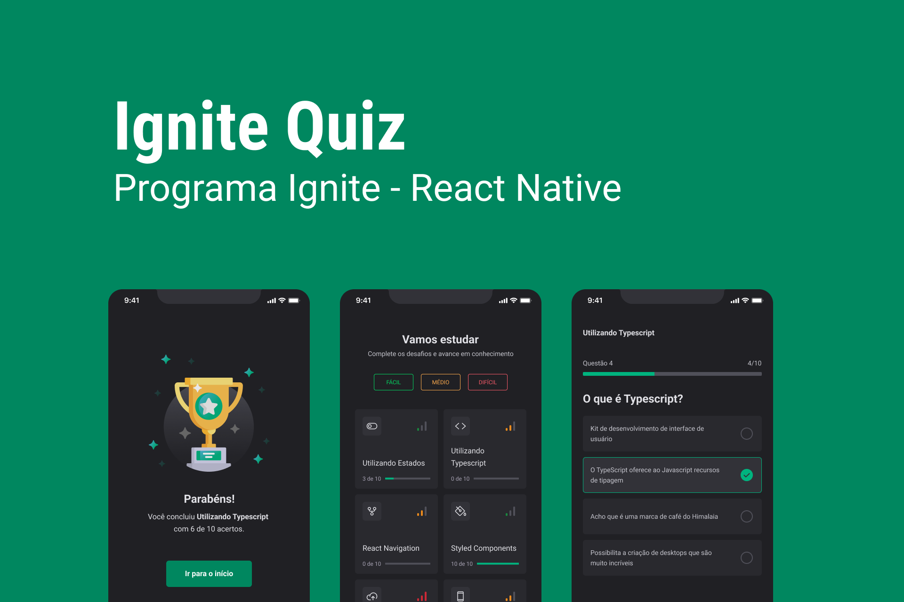

# 🚀 Ignite Quiz - React Native

<p align="center">
  
</p>

O **Ignite Quiz** é uma aplicação de perguntas e respostas para entusiastas de programação, desenvolvida para testar e aprimorar conhecimentos técnicos de forma interativa e dinâmica.

---

## 💻 Sobre o Projeto

O Ignite Quiz foi projetado para tornar o aprendizado em programação mais divertido e desafiador. Com diversos tópicos e níveis de dificuldade, o usuário pode testar suas habilidades e acompanhar seu progresso ao longo do tempo.

### Funcionalidades Principais:

- **Quiz por Categoria e Dificuldade:** Escolha perguntas de acordo com seu nível.
- **Feedback Multissensorial:**
  - Resposta correta: Tela verde e som de acerto.
  - Resposta incorreta: Tela vermelha, vibração do dispositivo e som de erro.
- **Histórico de Resultados:** Todos os resultados são armazenados localmente e podem ser excluídos conforme desejado.
- **Animações e Gestos:** Utilização de efeitos visuais para transições suaves e gestos touch para interação com os cards.

A aplicação foi pensada para proporcionar uma experiência fluida e envolvente, com diversas animações e resposta tátil para cada interação.

---

## 🎨 Layout

<p align="center">
  
</p>

O design foi criado para ser visualmente atraente e intuitivo, utilizando **React Native Skia** e **Expo Google Fonts** para enriquecer a experiência visual.

---

## 🛠 Tecnologias Utilizadas

O projeto utiliza diversas tecnologias modernas para garantir uma aplicação robusta e interativa:

- **[React Native](https://reactnative.dev/)**: Framework principal para desenvolvimento mobile.
- **[TypeScript](https://www.typescriptlang.org/)**: Superset de JavaScript para maior segurança e tipagem.
- **[Async Storage](https://reactnative.dev/docs/asyncstorage)**: Armazenamento local persistente para o histórico de resultados.
- **[React Navigation](https://reactnavigation.org/)** e **[Native Stack](https://reactnavigation.org/docs/native-stack-navigator/)**: Navegação multi-telas eficiente.
- **[Expo Google Fonts](https://github.com/expo/google-fonts)**: Fontes customizadas para um design mais moderno.
- **[React Native Skia](https://docs.expo.dev/versions/latest/sdk/skia/)**: Criação de gráficos e animações 2D.
- **[React Native Gesture Handler](https://docs.swmansion.com/react-native-gesture-handler/docs/)**: Manipulação de gestos e interações touch.
- **[React Native Reanimated](https://docs.swmansion.com/react-native-reanimated/)**: Animações complexas e suaves.
- **[Expo-AV](https://docs.expo.dev/versions/latest/sdk/av/)**: Reprodução de sons para feedback auditivo.
- **[Expo Haptics](https://docs.expo.dev/versions/latest/sdk/haptics/)**: Feedback tátil para melhorar a experiência do usuário.

---

## 🚀 Como Executar o Projeto

### 1. Clonando o Repositório

Clone o projeto para o local desejado:

```bash
$ git clone git@github.com:andreviapiana/IgniteQuiz.git
```

### 2. Executando a Aplicação

Navegue até o diretório principal e instale as dependências:

```bash
$ cd IgniteQuiz
$ npm install
```

Inicie o projeto:

```bash
$ npm run start
```

Será exibido um QR Code no terminal. Siga os passos abaixo:

1. Instale o **Expo Go** no seu dispositivo (disponível na Play Store).
2. Escaneie o QR Code utilizando o aplicativo Expo Go.
3. A aplicação será carregada no seu dispositivo, pronta para uso!

---

## 📢 Contribuições e Sugestões

Se tiver sugestões de melhorias ou novos recursos, sinta-se à vontade para abrir uma issue ou enviar um pull request. Todo feedback é bem-vindo!

Explore o Ignite Quiz e desafie seus conhecimentos em programação! 💡
