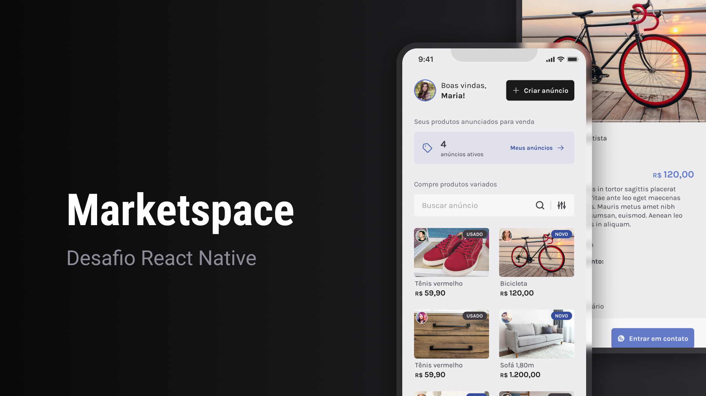

# Marketspace - Aplicativo Mobile de Compra e Venda de Produtos Usados e Novos

<p align="center">
  
</p>

## 📱 Sobre o Marketspace

O **Marketspace** é uma aplicação mobile desenvolvida em **React Native**, focada em facilitar a compra e venda de produtos usados e novos. Inspirado em plataformas como OLX, o app oferece uma experiência fluida e moderna para gerenciar anúncios, explorar produtos e interagir com outros usuários.



## 🎨 Layout da Aplicação

Você pode visualizar o layout completo do projeto no [Figma](<https://www.figma.com/design/ky64hWG7IlUNFIMSTH6DWw/Marketspace-%E2%80%A2-Desafio-React-Native-(Copy)?node-id=1798-1823&t=kxHx2gDb4GB01g3i-0>).

---

## ⚙️ Funcionalidades Principais

- **Login e Cadastro de Usuários:** Permite a criação e autenticação de usuários com segurança.
- **Gerenciamento de Produtos:** Criação, edição e exclusão de anúncios.
- **Listagem de Produtos com Busca e Filtros:** Encontre produtos com facilidade usando filtros por categoria, preço e localização.
- **Envio de Múltiplas Imagens:** Possibilidade de anexar várias imagens aos anúncios.
- **Histórico de Anúncios:** Visualize e gerencie seus produtos anunciados.

---

## 📚 Conceitos e Ferramentas Utilizados

O projeto foi desenvolvido utilizando os seguintes conceitos:

- **Estados:** Manipulação de estados internos para gerenciar a interface.
- **Context API:** Gerenciamento de estado global para manter a consistência dos dados entre diferentes telas.
- **Consumo de API:** Conexão com serviços externos para buscar e enviar dados.
- **Manipulação de Imagens:** Upload e exibição de imagens no app.
- **Formulários:** Uso de bibliotecas para validação e controle de entradas de usuários.
- **Navegação:** Navegação entre telas utilizando a biblioteca **React Navigation**.

---

## 🛠️ Tecnologias e Pacotes Utilizados

- [React Native](https://reactnative.dev/)
- [TypeScript](https://www.typescriptlang.org/)
- [Expo](https://expo.dev/)
- [Gluestack](https://gluestack.io/): Biblioteca de componentes para aumentar a produtividade no desenvolvimento de interfaces.
- [Bottom Sheet](https://github.com/gorhom/react-native-bottom-sheet): Exibição de menus e opções.
- [React Hook Form](https://www.react-hook-form.com/): Gerenciamento de formulários e validação de campos.
- [Yup](https://github.com/jquense/yup): Validação de dados.
- [Axios](https://axios-http.com/ptbr/docs/intro): Consumo de APIs REST.
- [Async Storage](https://reactnative.dev/docs/asyncstorage): Armazenamento local de dados.
- [React Native Reanimated Carousel](https://github.com/dohooo/react-native-reanimated-carousel): Carrossel animado de imagens.
- [React Native Gesture Handler](https://docs.swmansion.com/react-native-gesture-handler/docs/): Detecção de gestos na interface.
- [Expo Image Picker](https://docs.expo.dev/versions/latest/sdk/imagepicker/): Seleção de imagens no dispositivo do usuário.

---

## 🚀 Como Utilizar o Marketspace Localmente

### Pré-requisitos

- Node.js instalado
- Gerenciador de pacotes (npm ou yarn)
- Dispositivo físico ou emulador para testar o aplicativo

### Passos para Instalação

1. **Clone o repositório:**

   ```bash
   git clone https://github.com/usuario/marketspace.git
   ```

2. **Navegue até o diretório do projeto:**

   ```bash
   cd marketspace
   ```

3. **Instale as dependências:**

   ```bash
   npm install
   # ou
   yarn install
   ```

4. **Inicie o projeto:**

   ```bash
   npx expo start
   # ou
   yarn expo start
   ```

5. **Teste no dispositivo móvel:**
   - Escaneie o QR Code gerado usando o aplicativo **Expo Go** (disponível na Play Store e App Store).

---

## 📝 Licença

Este projeto está licenciado sob a licença **MIT**. Veja o arquivo [LICENSE](./LICENSE) para mais detalhes.

---

Aproveite o Marketspace e boas compras e vendas! 😊
